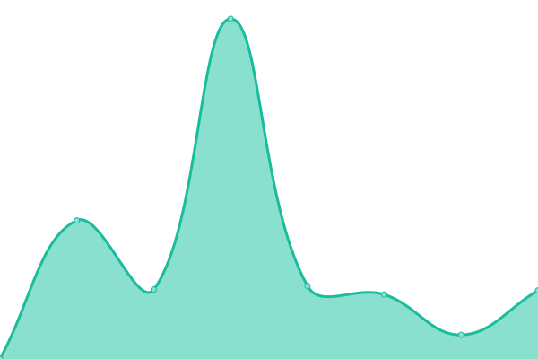
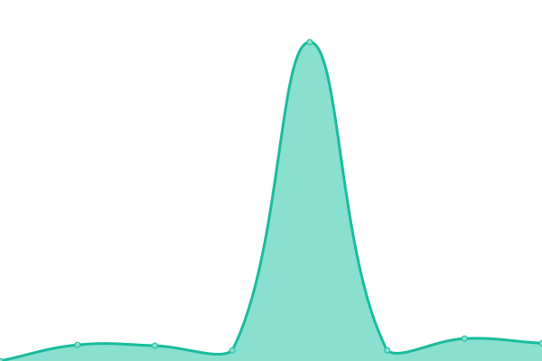

# [📈 Live Status](https://status.adffp.uk): <!--live status--> **🟧 Partial outage**

This repository contains the open-source uptime monitor and status page for [Adlai Dyson | Fused Frame Photography](adlaidyson.co.uk), powered by [Upptime](https://github.com/upptime/upptime).

With [Upptime](https://upptime.js.org), you can get your own unlimited and free uptime monitor and status page, powered entirely by a GitHub repository. We use [Issues](https://github.com/adlaidyson-ffp/statusadffp/issues) as incident reports, [Actions](https://github.com/adlaidyson-ffp/statusadffp/actions) as uptime monitors, and [Pages](https://status.adffp.uk) for the status page.

<!--start: status pages-->
<!-- This summary is generated by Upptime (https://github.com/upptime/upptime) -->
<!-- Do not edit this manually, your changes will be overwritten -->
<!-- prettier-ignore -->
| URL | Status | History | Response Time | Uptime |
| --- | ------ | ------- | ------------- | ------ |
|  [Main Website and Galleries](https://www.fusedframe.co.uk) | 🟩 Up | [main-website-and-galleries.yml](https://github.com/adlaidyson-ffp/statusadffp/commits/HEAD/history/main-website-and-galleries.yml) | 

 322ms
     
 | 

<a href="https://status.adffp.uk/history/main-website-and-galleries">100.00%</a>
    

|  [EXIF Overlay - Clean Summaries for Every Shot!](https://exifoverlay.com) | 🟩 Up | [exif-overlay-clean-summaries-for-every-shot.yml](https://github.com/adlaidyson-ffp/statusadffp/commits/HEAD/history/exif-overlay-clean-summaries-for-every-shot.yml) | 

 186ms
     
 | 

<a href="https://status.adffp.uk/history/exif-overlay-clean-summaries-for-every-shot">100.00%</a>
    

|  [Link in Bio](https://links.adlaidyson.co.uk) | 🟩 Up | [link-in-bio.yml](https://github.com/adlaidyson-ffp/statusadffp/commits/HEAD/history/link-in-bio.yml) | 

 0ms
     
 | 

<a href="https://status.adffp.uk/history/link-in-bio">100.00%</a>
    

|  [ADFFP Cloud (NextCloud)](https://cloud.fusedframe.co.uk) | 🟥 Down | [adffp-cloud-next-cloud.yml](https://github.com/adlaidyson-ffp/statusadffp/commits/HEAD/history/adffp-cloud-next-cloud.yml) | 

 1058ms
     
 | 

<a href="https://status.adffp.uk/history/adffp-cloud-next-cloud">99.76%</a>
    

|  [DocuSign (Document Signing Platform)](https://sign.adlaidyson.co.uk) | 🟩 Up | [docu-sign-document-signing-platform.yml](https://github.com/adlaidyson-ffp/statusadffp/commits/HEAD/history/docu-sign-document-signing-platform.yml) | 

 793ms
     
 | 

<a href="https://status.adffp.uk/history/docu-sign-document-signing-platform">100.00%</a>
    

|  [Content Delivery Network (CDN) - Cloudflare R2](https://cdn-eu.fusedframe.co.uk/main-branding/status.html) | 🟩 Up | [content-delivery-network-cdn-cloudflare-r2.yml](https://github.com/adlaidyson-ffp/statusadffp/commits/HEAD/history/content-delivery-network-cdn-cloudflare-r2.yml) | 

 121ms
     
 | 

<a href="https://status.adffp.uk/history/content-delivery-network-cdn-cloudflare-r2">100.00%</a>
    

|  [URL Shortener - adffp.uk](https://adffp.uk) | 🟩 Up | [url-shortener-adffp-uk.yml](https://github.com/adlaidyson-ffp/statusadffp/commits/HEAD/history/url-shortener-adffp-uk.yml) | 

 1020ms
     
 | 

<a href="https://status.adffp.uk/history/url-shortener-adffp-uk">100.00%</a>
    

|  [Shutter Society Mastodon](https://shuttersociety.uk) | 🟥 Down | [shutter-society-mastodon.yml](https://github.com/adlaidyson-ffp/statusadffp/commits/HEAD/history/shutter-society-mastodon.yml) | 

 1465ms
     
 | 

<a href="https://status.adffp.uk/history/shutter-society-mastodon">100.00%</a>
    

|  [Upper Haugh Weather (Frontend)](https://upperhaughweather.uk) | 🟩 Up | [upper-haugh-weather-frontend.yml](https://github.com/adlaidyson-ffp/statusadffp/commits/HEAD/history/upper-haugh-weather-frontend.yml) | 

 259ms
     
 | 

<a href="https://status.adffp.uk/history/upper-haugh-weather-frontend">100.00%</a>
    

|  [Upper Haugh Weather (API Backend)](https://api.upperhaughweather.uk/weather) | 🟩 Up | [upper-haugh-weather-api-backend.yml](https://github.com/adlaidyson-ffp/statusadffp/commits/HEAD/history/upper-haugh-weather-api-backend.yml) | 

 605ms
     
 | 

<a href="https://status.adffp.uk/history/upper-haugh-weather-api-backend">100.00%</a>
    

|  [VaultWarden Password Manager](https://vault.adlaidyson.co.uk) | 🟩 Up | [vault-warden-password-manager.yml](https://github.com/adlaidyson-ffp/statusadffp/commits/HEAD/history/vault-warden-password-manager.yml) | 

 488ms
     
 | 

<a href="https://status.adffp.uk/history/vault-warden-password-manager">100.00%</a>
    

|  [QR Code Generator](https://qr.adlaidyson.co.uk) | 🟩 Up | [qr-code-generator.yml](https://github.com/adlaidyson-ffp/statusadffp/commits/HEAD/history/qr-code-generator.yml) | 

 194ms
     
 | 

<a href="https://status.adffp.uk/history/qr-code-generator">100.00%</a>
    

|  [Authentik SSO](https://sso.adlaidyson.co.uk) | 🟩 Up | [authentik-sso.yml](https://github.com/adlaidyson-ffp/statusadffp/commits/HEAD/history/authentik-sso.yml) | 

 1130ms
     
 | 

<a href="https://status.adffp.uk/history/authentik-sso">100.00%</a>
    

<!--end: status pages-->

[**Visit our status website →**](https://status.adffp.uk)

## 📄 License

- Powered by: [Upptime](https://github.com/upptime/upptime)
- Code: [MIT](./LICENSE) © [Anand Chowdhary](https://anandchowdhary.com), supported by [Pabio](https://pabio.com)
- Data in the `./history` directory: [Open Database License](https://opendatacommons.org/licenses/odbl/1-0/)
